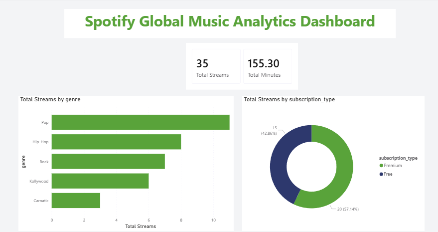

# Spotify Global Music Analytics Dashboard

A comprehensive end-to-end data analytics project that models Spotify listening history, processes relational data using SQL, and visualizes music consumption trends through an interactive Power BI dashboard.

---

## Dashboard Preview


   
   *Dashboard overview displaying total streams, total listening minutes, genre distributions, and user subscription demographics.*

---

## Project Overview & Architecture

This project simulates real-world Spotify streaming data to unlock insights regarding user behavior, regional genre popularity, peak streaming hours, and subscription preferences.

### Tech Stack
*   **Database Management:** MySQL / SQL Server (Relational Modeling & Aggregations)
*   **Data Visualization:** Microsoft Power BI
*   **Documentation:** Markdown

---

## Database Schema & Analysis

The project leverages a relational database structure designed to track user interaction metrics seamlessly across three normalized tables[cite: 2]:
*   **`users`**: Demographics and plan types[cite: 2].
*   **`tracks`**: Music metadata (Artists, Genres)[cite: 2].
*   **`listening_history`**: Transactional stream logs tracking timestamped user sessions[cite: 2].

> **SQL Scripts Included:** Complete Data Definition Language (DDL) setup, data inserts, and advanced analytical business queries (using `JOIN`s, analytical aggregations, and window ranking functions) are fully documented inside the [SpotifyDB_Project.sql](SpotifyDB_Project.sql) file[cite: 2].

---

## Key Dashboard Insights & Findings

Based on the visuals compiled inside `Spotify_Music_Analytics_Dashboard.pbix` (as captured in `image_85bdc1.png`):

*   **Total High-Level KPIs:** The platform logged **35 Total Streams** yielding **155.30 Total Playtime Minutes**[cite: 1].
*   **Genre Preferences:** **Pop** is the dominant genre globally, closely trailed by **Hip-Hop** and **Rock**[cite: 1]. Regional segments such as *Kollywood* and *Carnatic* represent highly active listener pockets[cite: 1].
*   **Subscription Funnel Metrics:** **Premium members** drive the highest engagement, accounting for **57.14%** (20 Streams) of total activity, while **Free tier users** occupy **42.86%** (15 Streams)[cite: 1].

---

## Repository Structure

```text
├── Spotify_Global_Music_Analytics/
│   ├── SpotifyDB_Project.sql                     # SQL Script with DDL, Inserts & Analytical Queries
│   ├── Spotify_Music_Analytics_Dashboard.pbix    # Microsoft Power BI Workbook Document
│   ├── Spotify_Music_Analytics_Dashboard-Preview.png # Dashboard visual capture
│   └── README.md                                 # Project Documentation
